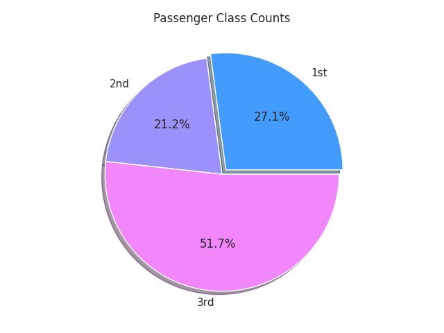
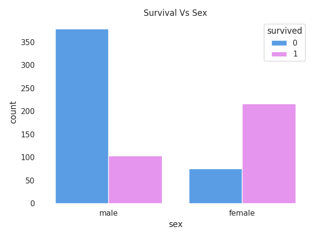
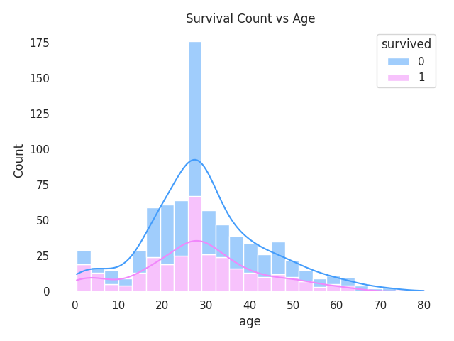
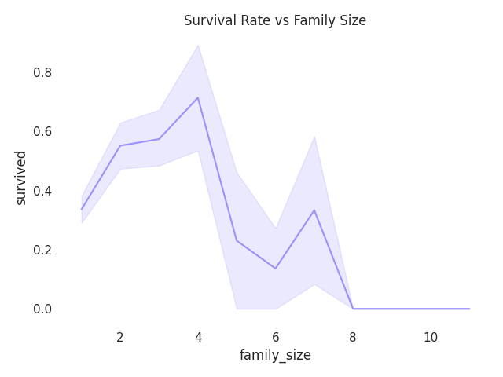
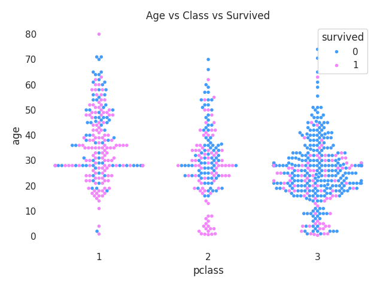
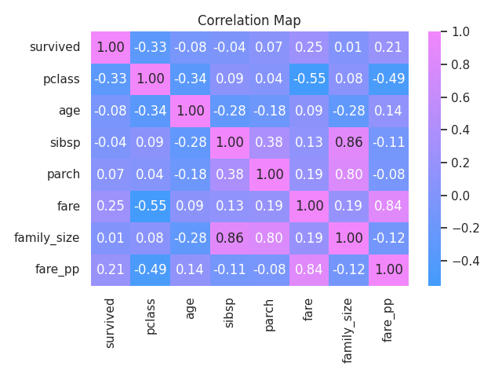

# Titanic Dataset — Exploratory Data Analysis

Exploratory data analysis on the Titanic passenger dataset (from seaborn) using Python.  
Covers the full pipeline: data cleaning → feature engineering → visualization.

---

## Key Findings

### Women were much more likely to survive
Around 75% of female passengers survived, compared to only 20% of male passengers.
### Passenger class had a big impact on survival
First-class passengers had the highest survival rate at about 63%, while third-class passengers had the lowest at around 26%. Second class was in between at roughly 50%. First-class tickets also cost much more than third-class tickets.
### People travelling alone were less likely to survive
Passengers travelling by themselves had a survival rate of only 35%. Those travelling in small families (2–4 people) had the best chances, with survival rates reaching 70–85%. Survival dropped sharply for larger families (5+ people).
### Paying more meant better odds of survival
Ticket price and passenger class were closely related. Passengers who paid higher fares were generally in higher classes and had better survival rates.

<p align="center">
  
  
  
</p>

<p align="center">
  
  
</p>

---

## Project Structure

```
titanic-eda/
├── notebooks/
│   └── titanic_eda.ipynb
├── images/
│   └── survival_by_sex.png
│   └── survival_by_size.png
│   └── survival_by_age_class.png
│   └── correlation_heatmap.png
├── README.md
└── requirements.txt
```

---

## What's Covered

**Data Cleaning**
- Age (20% missing) -> filled with median (right-skewed distribution)
- Deck (80% missing) -> dropped entirely
- Embark town (2 missing) -> filled with mode
- Embarked -> dropped (duplicate of embark_town)
- Duplicates -> checked and removed
- Outliers -> checked for bounds

**Feature Engineering**
- `family_size` = sibsp + parch + 1 (self included)
- `fare_pp` = fare per person (fare ÷ family_size)
  
---

## Notable Observations from the Heatmap

| Pair | Correlation | What it means |
|---|---|---|
| pclass ↔ fare | -0.55 | higher class = lower class number = higher price |
| survived ↔ pclass | -0.33 | higher class number = lower survival |
| survived ↔ fare | 0.25 | passengers who paid more survived more |

</img>

---

## Libraries

```
numpy
pandas
matplotlib
seaborn
```
